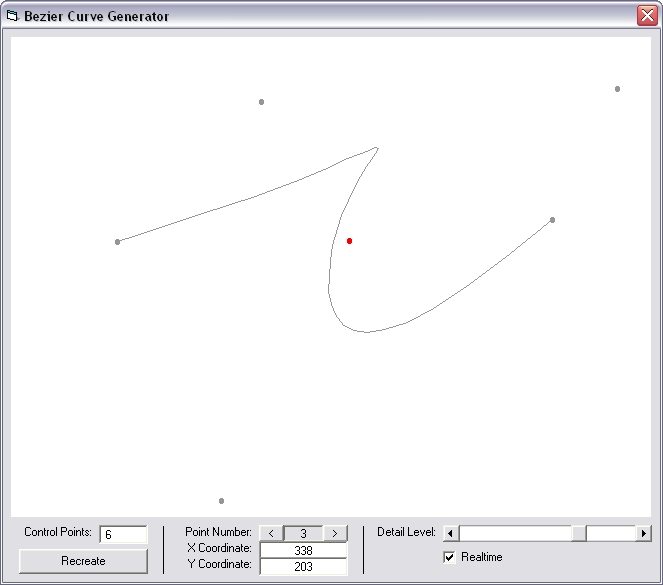



## Bezier Curve Generator

### Description

This program allows simple creation of bezier curves. Given the 'Control Points' (the points which a bezier curve is based upon - two end points and any others to affect the curve), the 'CalculateBezier' function will return the coordinates of a point anywhere along the curve. The front-end to the function just shows you what a bezier curve is, and the large capability of the function to accept as many control points as you want (the front-end limits it to 99, but the function will accept more if necessary). The code is marked at 'Advanced' level because of the complexity of the equations used, although programmers at the 'Intermediate' stage might be able to understand it.
 
### More Info
 

             |
---                |---
**Submitted On**   |2004-02-10 12:43:02
**By**             |[Craig Bonathan](https://github.com/Planet-Source-Code/PSCIndex/blob/master/ByAuthor/craig-bonathan.md)
**Level**          |Advanced
**User Rating**    |5.0 (15 globes from 3 users)
**Compatibility**  |VB 6\.0
**Category**       |[Math/ Dates](https://github.com/Planet-Source-Code/PSCIndex/blob/master/ByCategory/math-dates__1-37.md)
**World**          |[Visual Basic](https://github.com/Planet-Source-Code/PSCIndex/blob/master/ByWorld/visual-basic.md)
**Archive File**   |[Bezier\_Cur1706762102004\.zip](https://github.com/Planet-Source-Code/craig-bonathan-bezier-curve-generator__1-51646/archive/master.zip)

